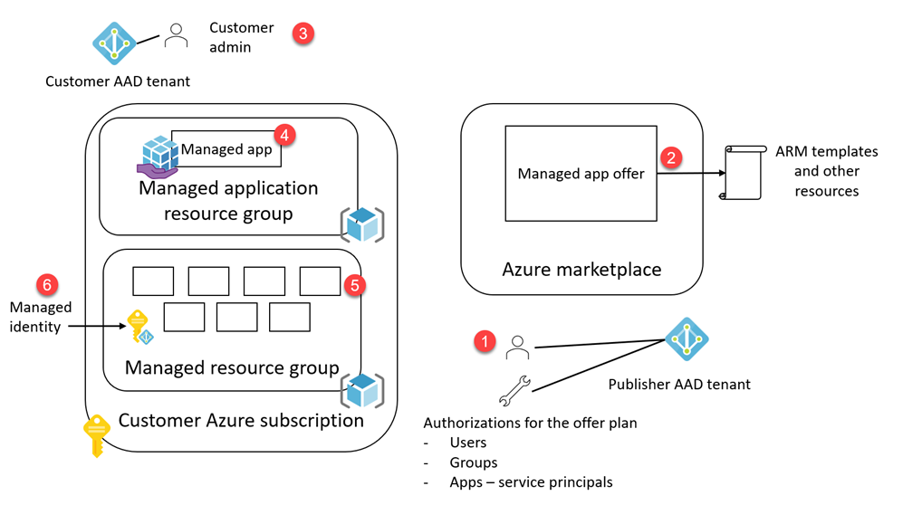
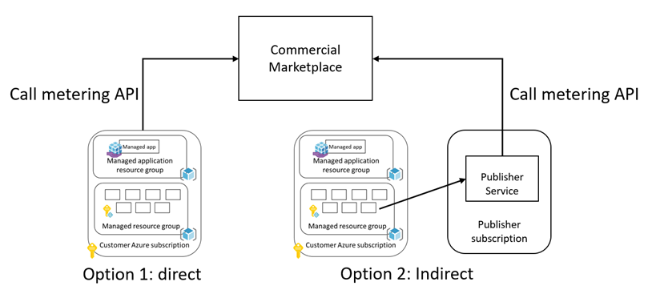
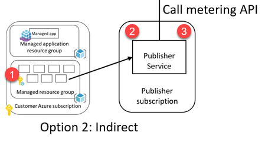
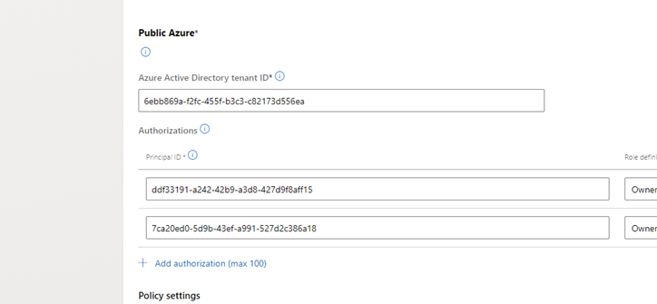

# Posting custom meters for a Commercial Marketplace managed app offer

I have been working with a few teams to help them use managed app offers with custom meters. I would like to consolidate my notes here for the general public's consumption. Usual disclaimer apply, this is sample only, use it at your own risk, understand the concepts throughly before implementing your own. 

What you need to know
- Deploying resources to Azure subscriptions
- Azure Active Directory (AAD) concepts, such as users, groups, application registrations, service principals, authenticating with AAD, and auhorizing access to resources
- Role based access control (RBAC) on Azure
- Managed applications
- Calling marketplace APIs

## Managed applications overview

The [Azure documentation for managed applications](https://docs.microsoft.com/en-us/azure/azure-resource-manager/managed-applications/overview) says this:

> Azure managed applications enable you to offer cloud solutions that are easy for consumers to deploy and operate. You implement the infrastructure and provide ongoing support. To make a managed application available to all customers, publish it in the Azure marketplace. To make it available to only users in your organization, publish it to an internal catalog.

Here is how marketplace managed apps work.

1. Publisher creates a managed app offer on Partner Center, with at least one plan having assets, as mainTemplate.json, createUIDefinition.json and other resources such as scripts, files, and linked templates. Assigns authorizations for the plan. These can be users, groups and service principals for apps.
2.  Publisher publishes the offer to Azure Marketplace.
3. Customer locates the offer on Azure Marketplace and subscribes to it.
4. This action creates a Managed Application (Azure resource type, **Microsoft.Solutions/applications**) resource in a resource group of customer's choosing.
5. It also creates a managed resource group where the resources defined in the maintemplate.json in step (2) are deployed to.
6. The template also needs to define a managed identity that is also deployed along with those resources. I will explain this later.



At the end of this operation, the various identities, such as the customer admin, the ones listed on the authorizations and the managed identity can do the following:
- Identities on the offer plan authorizations list can
    - Be an owner or contributor to the resources in the managed resource group (5)
    - Read the managed app created in (4) 
- Customer admin
    - Has the full control on the managed app (4), can delete it, and when he/she deletes it, the managed resource group (5) is also deleted, along with managed resources
    - Has read access to managed resource group (5)
- Managed identity
    - Needs to have at least read permission requested on the managed resource group (5) in the maintemplate.json

## Posting usage data to Commercial Marketplace using metering APIs

You can take two approaches when posting usage using the metering APIs.
1. Post directly by the deployed resources on the customer deployments.
2. Send usage data to your central location you maintain, and post from there.



I will go through option 2 for the moment, and later update this document for option 1.

### Option 2

Let's first look at the various identities that needs to access resources for reading data and calling the metering APIs.



1. Managed identity needs to have at least read access to the managed resource group, so it can read the Azure subscription id of the customer, the managed resource group id. This information is available through the metadata url on Virtual Machines. The VM deployed on the managed resource group tracks the usage and reports it to the publisher service.
2. The publisher service uses the AAD app registration added to the plan authorizations list on the Partner Center to access the **billingProperties** property of the managed app by calling the Azure management APIs.
3. The publisher service calls the metering API using the AAD app registration details provided in the "Technical configuration" tab of the offer to post to the metering API.

Now let's go through setting this up. 

I am assuming you already have a published (or in preview) managed app that has at least one VM in it, with RBAC configured so the managed identity it is running under has access to the managed resource group. [Please see this as an example](https://github.com/Ercenk/marketplacemanagedappwithmeters/blob/master/artifacts/user-assigned/mainTemplate.json#L250). 

I am also assuming you have an AD group ID added to the authorizations list on your offer's plan's technical configuration page.

1. Make a new app registration on Azure AD to eventually call the management APIs.

```
    az ad app create --display-name "ErcAppManager"
```    

    Get the id of the registered app with 

```    
    az ad sp list --query "[?displayName=='ErcManagedApp2'].{appId:appId}"
```    

For example the above command returns the following
```
    [
        {
            "appId": "74a5e576-bf02-4a23-add8-a031c5820b14"
        }
    ]
```

Also get the objectId of the service principal with the following

```
    az ad sp list --query "[?displayName=='ErcManagedApp2'].{objectId:objectId}"
```

It should return something like this
```
    [
        {
            "objectId": "7ca20ed0-5d9b-43ef-a991-527d2c386a18"
        }
    ]
```

2. Add the app registration to the AD group recorded in the authorizations list, alternatively, find the service principal for the app registration on "Enterprise applications" list on your directory, and add the object ID of the SP to the authorizations list.



3. Now we will simulate an application calling Azure Management API to access the managed app
4. Go to Azure Portal, Azure Active Directory blade, find your newly created app registration, click on Certificates & secrets and add a secret. Copy the secret, you will not be able to access it again.
4. Open a command line, and type in the following 
    4.1 Request an access token
```
        curl -X POST -d 'grant_type=client_credentials&client_id=[APP_ID]&client_secret=[PASSWORD]&resource=https%3A%2F%2Fmanagement.azure.com%2F' https://login.microsoftonline.com/[TENANT_ID]/oauth2/token
```    

Now copy the value of the return access_token, and insert into the following cUrl call. We are assuming your code in the deployed VM will be providing the subscription 

```
    curl -X GET -H "Authorization: Bearer [TOKEN]" -H "Content-Type: application/json" https://management.azure.com/subscriptions/[SUBSCRIPTION_ID]//resourceGroups/[RESOURCEGROUPFORTHEMANAGEDAPP]/providers/Microsoft.Solutions/applications/[MANAGEDAPPNAME]?api-version=2019-07-01 | jq
```

This should return the  **billingDetails** property with **resourceUsageId**.

Now you need to get an access token for your AAD app registration for calling the metering APIs, you have resourceId (resourceUsageId value from above), and the count of the meter you want to post.


